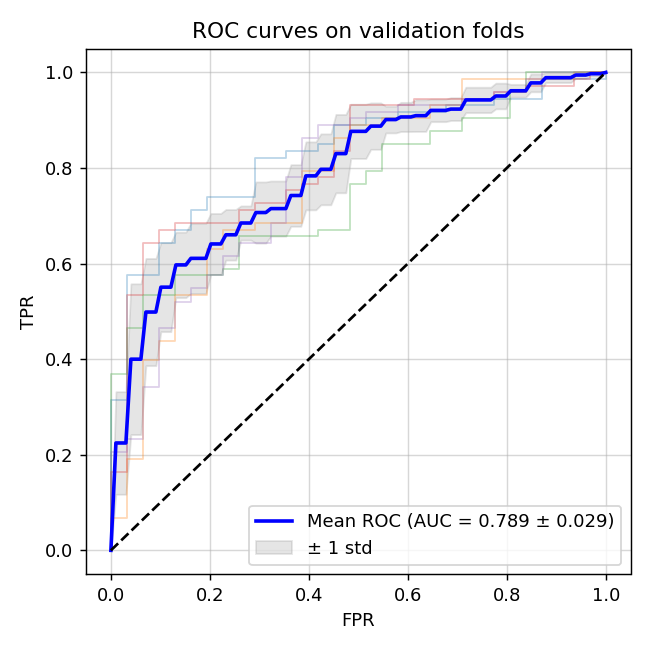
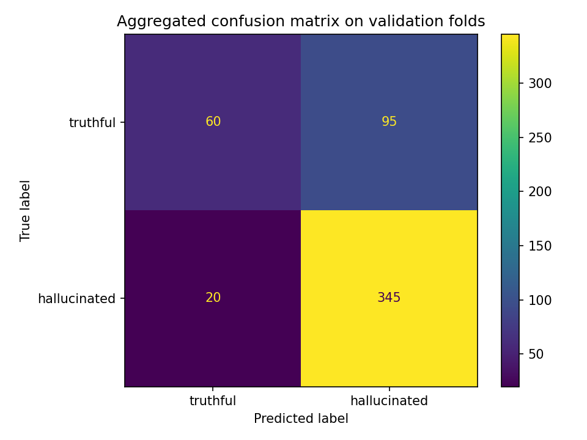
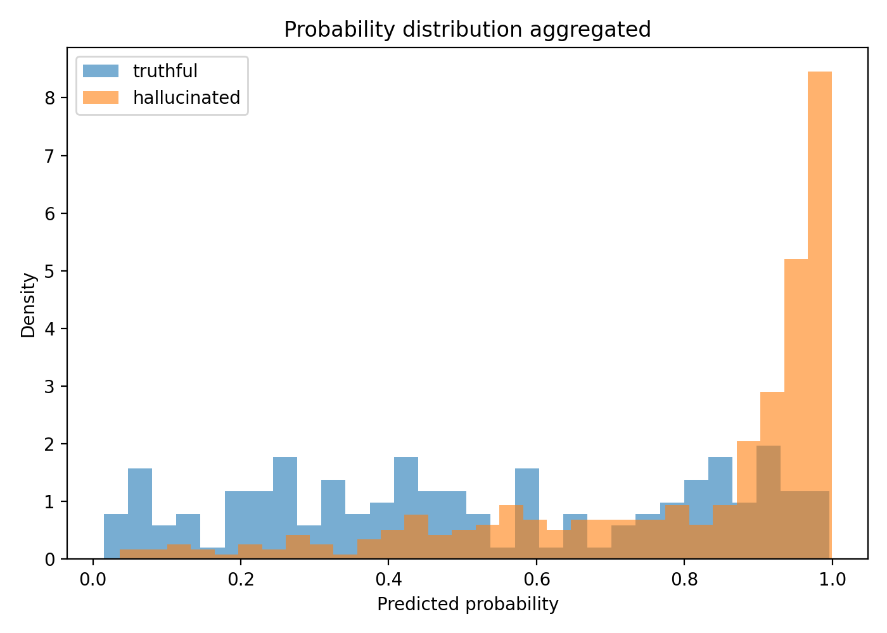
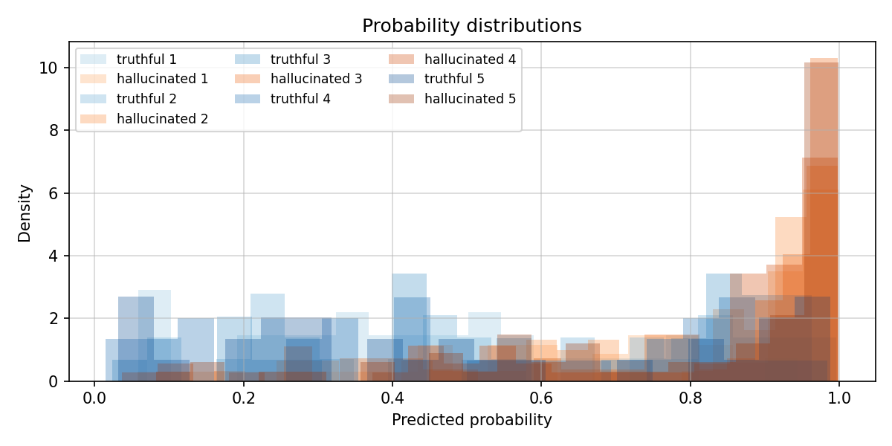

# SOLUTION

## Task

Given a prompt and a response from `Qwen2.5‑0.5B`, we need to predict whether the response is hallucinated (label 1) or truthful (label 0) using only the model's internal hidden states. The training set contains 689 labelled examples and the test set has 100 unlabelled examples. The primary metric is accuracy on the test set.

## Setup

The solution was developed and tested on Google Colab with an **L4 GPU**. Run:

```bash
git clone https://github.com/pymlex/SMILES-2026-Hallucination-Detection
cd SMILES-2026-Hallucination-Detection
pip install -r requirements.txt
python solution.py
```

Only `aggregation.py`, `probe.py` and `splitting.py` were modified.

## Solution

### Feature extraction

All prompts from `data/dataset.csv` and `data/test.csv` are tokenised in advance and their token lengths are recorded. During feature extraction, only response tokens are used. 

Hidden states for analysis are taken from layers **12, 13, and 16**. They are pooled in two ways:

- max pooling over the response tokens
- mean pooling over the response tokens

The resulting six vectors (3 layers with 2 pooling methods applied) are concatenated together with a single scalar, which is the normalised response length equal to `response_length / 512`. This gives a 5377‑dimensional feature vector.

### Classifier 

`HallucinationProbe` is an ensemble of **10** `LogisticRegression` models. Each model is trained on a bootstrap sample of the training set, the loss is:

$$\hat{\beta}_i = \arg\min_{\beta} \Bigg[ -\frac{1}{|B_i|}\sum_{j \in B_i} \big[ y_j \log p_j + (1-y_j)\log(1-p_j) \big] + 0.01 \cdot \|\beta\|_2^2 \Bigg]$$

Predictions are obtained by averaging the predicted probabilities of all 10 models:

$$p(y=1 \mid x) = \frac{1}{10}\sum_{i=1}^{10} p_i(y=1 \mid x)$$

The decision threshold is tuned on the validation split of each fold to maximise **accuracy** while the test set, of course, remains untouched.

### Splitting

We used 5‑fold stratified cross‑validation. Inside each outer fold an additional stratified split creates a validation set for threshold calibration. All folds preserve the original 70/30 class ratio, and we expect this ratio to hold in `test.csv`.

## Results

### Metrics

5‑fold cross‑validation on the labelled dataset:

| Checkpoint               | Accuracy |   F1   |  AUROC |
|--------------------------|:--------:|:------:|:------:|
| Majority‑class baseline  |  70.10%  | 82.42% |   N/A  |
| Probe (train)            |  90.12%  | 93.49% | 99.50% |
| Probe (val)              |  77.88%  | 85.73% | 79.08% |
| Probe (test)             |  74.02%  | 83.16% | 78.88% |

Mean AUC is 0.789 ± 0.029. The model performs consistently better than random guessing, it is also stable.



The final probe was retrained on all 689 labelled examples. It was used to produce `predictions.csv` for the 100‑sample test set.

### Aggregated confusion matrix



The majority of errors come from truthful answers that the model mislabels as hallucinated.

### Probability distribution

The histogram shows the predicted probabilities for both classes across all validation folds. Hallucinated samples are sharply concentrated around 0.95–1.0, while truthful samples spread across the whole range. It shows that the model is very confident on hallucinations but uncertain on some truthful answers.



### Probability distributions per fold

Overlaid histograms for each fold show that the separation remains stable across different data splits. All five folds exhibit similar behaviour. There is a narrow peak for hallucinated samples around 1.0 and a broad distribution for truthful samples.



## Experiments and discarded ideas

### Classifier

- **MLP** from 5 to 1000 neurons with ReLU and GELU, dropout, and batch norm consistently reached train AUROC about 1.0 while validation AUROC plateaued around 0.72–0.78. We guess a small dataset with high-dimensional features cannot support a neural probe.
- **RandomForest** and **CatBoost** overfit less than MLPs but still underperformed a heavily regularised logistic regression.
- **Logistic regression ensemble** with the number of models increasing from 5 to 10, 50 or 100 gave virtually identical results within approximately 0.2 pp AUROC.

| Number of logreg models | Test AUROC |
|-------------------------|:----------:|
|  5                      |   78.28 %  |
| 10                      |   78.88 %  |
| 20                      |   78.74 %  |
| 50                      |   78.69 %  |
|100                      |   78.87 %  |

Ten models were chosen as the lightest configuration with no loss in quality.

### Layer selection

Each layer was tested individually with the same feature extraction, which is max and mean pooling with a single response length feature. Later, groups of layers were evaluated:

- Layer **16** alone gives 1.0 pp improvement over the baseline in AUROC compared to random layers.
- Layers **12–13** together add another 0.5 pp.
- Using only layers 12–13 gives about 78.3% AUROC. Adding layer 16 brings it to 78.9%, we chose this option.
- Adding layers 20–24 did not improve, so they were discarded.
- Using all 24 layers caused severe overfitting.

### Features

- **Only max pooling** without mean gives a slightly lower AUROC.
- **Only mean pooling** is noticeably worse.
- **Response length** consistently adds about 1–2 pp AUROC.
- **PCA** degraded performance, likely because the hallucination signal lives in low‑variance directions, that is a hypothesis.
- **Geometric** scalars such as norms, cosine drift, `L2` distances did not improve the final result and were omitted.